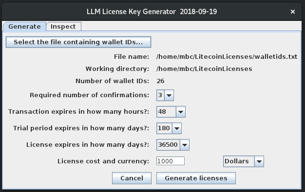

## LLM License Key Generator

Before using the Litecoin License Manager License Key Generator you need to have produced text file of Litecoin wallet IDs.  Read how to generate this file [here](extra/ltcwallet.md).

## License Key Generation

A license key is a serialize Java License object. Code for the License object can be found in the License.java file.  This object contains various parameters that you the developer (also referred to as the "merchant" in the code) will set.  To make setting parameters and serializing License objects easy, I have written an [app](https://github.com/mbcladwell/LLMLitecoinLicenseGenerator/tree/master/build/distributions) that will collect the parameters and serialize them into a License object for you.  Here is the main interface:

Here is a table of the various License parameters and their usage:

|Parameter|Description|
|---------|--------------|
|Wallet ID| Your (the developer's) Litecoin wallet ID, into which you would like the licensing fees for your software deposited|
|Transaction ID|The transaction ID from the Litecoin blockchain that supplied your wallet with the licensing fees|
|Transaction date|Date of the Litecoin transfer transaction|
|Confirmations|The required number of blockchain confirmations required before trusting that the transfer has been verified by the network|
|Transaction expiration|Number of hours within which the licensee needs to confirm the transaction using the Litecoin License Manager software|
|License expiration|Number of days for which the license is valid|
|License cost|Cost specified in dollars or Litecoin|

Once your license files have been serialized, you can switch to the inspect tab of the utility to confirm the values.

A goal of the Litecoin License Manager is to allow you the developer to non-interactively collect licensing fees for your software.  Since there are no third party arbitrators of disputes, any issues that arise will force an interaction between you and your customers.  Therefore you want the process to be as easy as possible while at the same time discouraging cheating on the part of the users.  A few scenarios are outlined below, with increasing security, but also placing more burden on the customer.

### Scenario I: Shareware with the opportunity for donations

Confirmations required = 0

Transaction expiration = 8760 hours ( 1 year)

Trial expiration = 180 days

License expiration = 36500 days (100 years, essentially a perpetual license)

In this scenario you are using the LLM as a means to provide the user with your wallet ID and make it easy to collect donations.  If a donation is provided, the "Licensed" panel will display for the user.

### Scenario II: Trial period

Confirmations required = 3

Transaction expiration = 48 hours 

Trial expiration = 30 days

License expiration = 365 days 

You are providing the user with 30 days to evaluate your software.  At the end of 30 days the licensed flag is set to false and the software is locked down. A payment will unlock the software for 1 year. 

### Scenario III:  Feature lock down

Similar to above only rather than locking down the entire application, only certain features are locked down by checking the value of <code>LicenseManager.getLicenseStatus()</code>.  Certain features can be made available during the trial period, and then all or a subset can be locked down when the trial expires.

## Notes on parameters

Number of confirmation required:  Generally 3 is considered good to avoid double spending.  6 would be high security. 0 is for the ease of use for the customer as it would require no waiting.

Transaction expiration in hours:  Requires the customer to confirm the transaction within X number of hours.  8760 hours (1 year) is for ease of use.  Use small values if you have multiple geographically colocalized (same company) customers who might make a single payment used to confirm multiple licenses.  A limited time window for confirmation prevents users from scanning the blockchain for transfers to your wallet and using those transfers to validate their license.  Avoid this possibility by giving each user a separate wallet ID and setting transaction expiration to 8760 hours.
