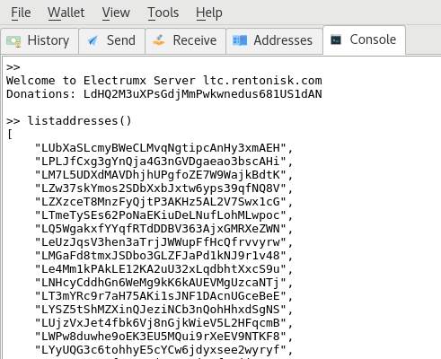

## Litecoin wallet installation

There are numerous ways to work with Litecoin, including using the [core](https://litecoin.org/) software directly.  I recommend [Electrum-ltc](https://electrum-ltc.org/), a lightweight, deterministic brain wallet. Follow the installation directions, generate your seed, then generate a bunch of Wallet IDs, as many as you would like to generate Litecoin Licenses for.  Go to the Electrum console and type the command <code>listaddresses()</code> to get the following view:



These addresses can now be copied into a text file, one wallet ID per line.  Do not include quotes or other special characters so remove them with find/replace.  The final file should look like:

```bash

LNHcyCddhGn6WeMg9kK6kAUEVMgUzcaNTj 
LT3mYRc9r7aH75AKi1sJNF1DAcnUGceBeE 
LYSZ5tShMZXinQJeziNCb3nQohHhxdSgNS 
LUjzVxJet4fbk6Vj8nGjkWieV5L2HFqcmB 
LWPw8duwhe9oEK3EU5MQui9rXeEV9NTKF8 
LYyUQG3c6tohhyE5cYCw6jdyxsee2wyryf 
LSXV7tUc31fq6QYRjXmo1ojWnfNBji67B4 
LTWW9W8C8Fc6eeyYJUdWafnG6ZjMw3fTSm 

```

Once you have generated a wallet IDs file, you are ready to move on to the next step, which is generating a license key file for each wallet ID using the Litecoin Licence Manager [Licence Key Generator](https://github.com/mbcladwell/LLMLitecoinLicenseGenerator).

